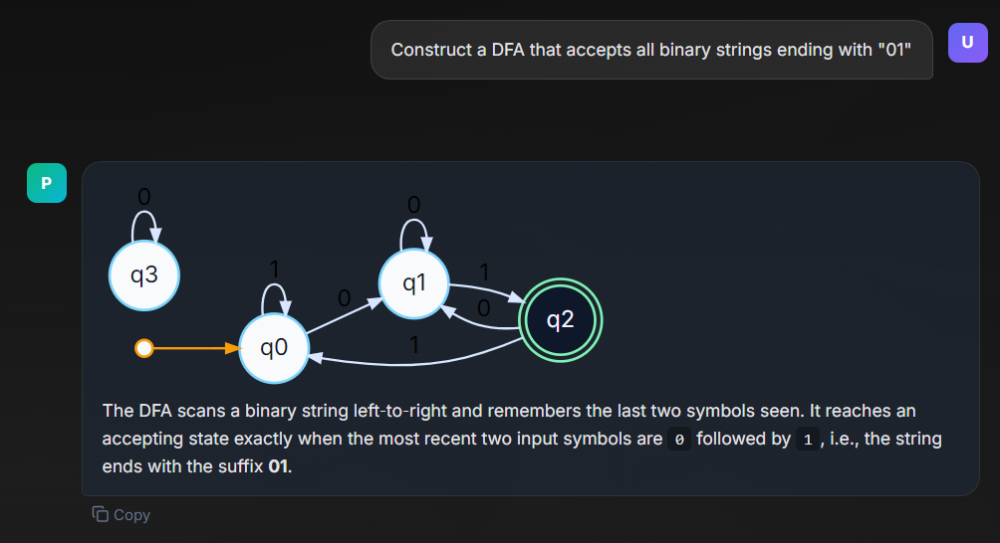

# PlugLM

### Making your LLM experience more visual and more impactful.

Plugins that use libraries and blend LLM responses with useful visual aids like graphs, machines and labels to help you grasp the dumps of text better.

#### Proof-of-concept stage

- Supports openrouter api keys
- Basic chat functionality
- Simple Finite State Automata Plugin

#### Working

For now an Finite-State-Automata (FSA) plugin exists
It can map out FSAs using Viz-js depending on the capability of LLM provided.

(LLMs used: OpenAI GPT oss 120B and Nvidia Nemotron 3 Super)

##### Future work

- Support PDF inputs
- Better chat retention and reference
- Plugin marketplace
- Removing need of entering API key everytime
- Proper way of installing plugins (manifest json and pulling)
- Redesign of UI (AI temp for PoC)
- Support for API keys from different vendors
- Token streaming will be added later
- Website Deployment
  
#### Plugin format

Refer to FSA folder under plugins for template of how a plugin should look like.
Ideally, jsons for manifest and schema with a prompt markdown file and a renderer component.

#### Usage Instructions

Basic frontend will work out of the box with

`npm install`

followed by

`npm run dev`

Add your custom plugins as a seperate folder with FSA under plugins

Openrouter API Key and Model Requested can be set under settings tab.

FSA Plugin requires Viz-js library

## License

This project is licensed under the GNU Affero General Public License v3.0 (AGPL-3.0).
